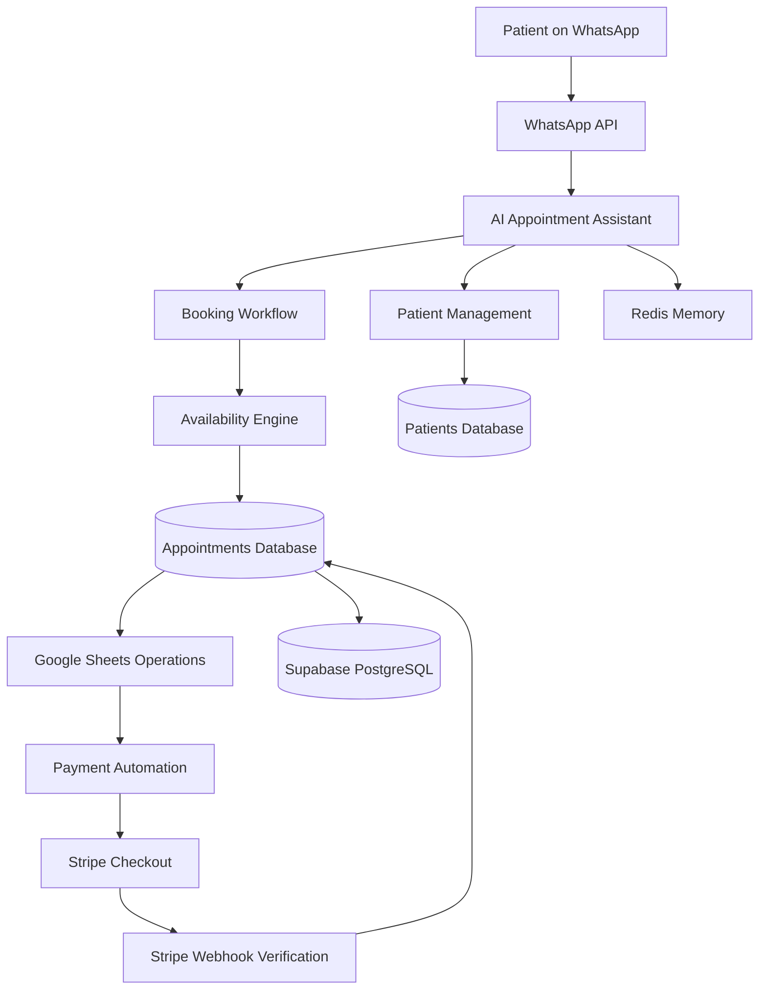

# AI WhatsApp Clinic Assistant  
### Automated Doctor Appointment & Billing System

---

# Overview

Here is a system that I built for a client to solve a major operational problem faced by many healthcare clinics: **managing patient appointments and billing through WhatsApp without overwhelming reception staff**.

In many clinics, WhatsApp is the primary communication channel for patients. However, when appointment bookings, cancellations, and payment requests are handled manually, the process quickly becomes chaotic. Receptionists must respond to dozens of messages while simultaneously checking spreadsheets to confirm availability and recording patient details.

This system replaces that manual process with an **AI-powered WhatsApp receptionist** that automatically manages appointments, patient records, and billing workflows.

Patients interact with the clinic exactly the same way they normally would — by sending a WhatsApp message — but behind the scenes an automated system handles the scheduling logic, prevents double bookings, and coordinates payments once the doctor determines the consultation fee.

The result is a **24/7 automated clinic receptionist** that reduces administrative workload while improving patient experience.

---

# The Business Problem

Small and medium clinics often rely on manual messaging to manage appointments. As patient volume grows, several operational issues appear.

Receptionists must respond to booking requests while also verifying doctor availability. This frequently leads to delays in responses and sometimes lost appointments when patients do not receive quick replies.

Manual scheduling also increases the risk of errors. Staff must constantly verify whether a time slot is available, check working hours, and ensure the patient details are recorded correctly. During busy hours, double bookings can occur easily.

Billing introduces another layer of complexity. In healthcare environments, the consultation cost cannot always be determined at the time of booking. Doctors often need to evaluate the patient before deciding the correct amount. Because of this, receptionists must manually contact patients later to request payment, which is inefficient and inconsistent.

Additionally, many patients use the same WhatsApp number to book appointments for family members. Without a structured system, it becomes difficult to track which appointment belongs to which person.

This system was designed to eliminate these inefficiencies while maintaining a familiar WhatsApp experience for patients.

---

# The Solution

The platform introduces an **AI-powered virtual receptionist** that interacts with patients through WhatsApp and automates the clinic's appointment workflow.

Patients can book appointments, reschedule them, cancel them, or check upcoming bookings directly through WhatsApp. The assistant guides the user step by step through the booking process and automatically stores patient data.

The system dynamically calculates available time slots based on clinic working hours and existing bookings. This prevents double bookings and ensures the doctor’s schedule remains accurate.

Billing is handled separately from appointment booking to match real healthcare processes. Once the doctor determines the consultation cost, staff update the appointment record and mark the payment as ready. The patient then receives a notification that their bill is available and can generate a secure Stripe payment link when they are ready to pay.

This design ensures that the automation aligns with how clinics actually operate.

---

# Key Features

The system provides a complete automated appointment workflow.

Patients can create new bookings directly through WhatsApp without speaking to staff. The assistant collects patient details, checks availability, and confirms the appointment instantly.

The system also allows patients to view their upcoming bookings, reschedule appointments, or cancel them without needing to call the clinic.

Multiple patient profiles can be managed under the same WhatsApp number, which allows parents or caregivers to manage bookings for family members.

The scheduling engine dynamically generates time slots based on the clinic’s working hours and removes unavailable times automatically.

Stripe integration enables secure payment processing once consultation fees are determined.

Because the assistant runs on automation workflows, it operates continuously and significantly reduces receptionist workload.

---

# Client Impact

After deploying this system, clinics typically experience several operational improvements.

Administrative workload is significantly reduced because routine booking conversations are automated.

Patients receive immediate responses when they send messages, even outside clinic hours. This improves the booking experience and reduces missed appointments.

Scheduling errors such as double bookings are eliminated because the system verifies availability before confirming any appointment.

Payment collection also becomes more reliable. Instead of manually chasing patients for payment, the system automatically sends secure payment links when bills are ready.

Overall, the clinic benefits from a more organized workflow while patients enjoy a faster and more convenient booking experience.

---

# Example Patient Interaction

Below is a simplified example of how a patient interacts with the assistant.

```
Patient:
Hello

Assistant:
Hello, welcome to Doctor Clinic!

Please choose an option:
1. New Booking
2. My Upcoming Bookings
3. Reschedule Booking
4. Cancel Booking
5. Payments

Patient:
1

Assistant:
Please choose a patient profile:
1. John Smith
2. Sarah Smith
3. Add New Patient

Patient:
1

Assistant:
Please choose an appointment date:
1. Monday
2. Tuesday
3. Wednesday

Patient:
2

Assistant:
Available time slots:
1. 10:00
2. 11:00
3. 12:00

Patient:
1

Assistant:
Your appointment has been booked successfully.
```

---

# System Architecture

The platform integrates messaging APIs, AI processing, automation workflows, and payment infrastructure.



---

# Technology Stack

The system combines several tools to create a scalable automation platform.

**Automation**

n8n workflow automation handles all backend logic including booking, scheduling, and payment workflows.

**AI Processing**

Gemini AI powers the conversational assistant and manages structured conversation flows.

**Messaging**

WhatsApp APIs provide the communication channel used by patients.

**Payments**

Stripe manages secure payment processing and webhook verification.

**Operational Data**

Google Sheets acts as a simple operational interface for clinic staff.

**Scalable Infrastructure**

Supabase (PostgreSQL) stores structured data while Redis manages conversation memory for active users.

---

# Deployment Overview

Deploying the system involves configuring a few key components.

First, the automation workflows are hosted in an n8n environment. This environment manages all interactions between messaging APIs, databases, and payment services.

Next, the WhatsApp API is connected so the system can receive and send messages.

Google Sheets is configured as the operational interface where clinic staff manage appointments, billing amounts, and payment readiness.

Stripe is connected to handle payment link generation and webhook verification.

Finally, Supabase and Redis provide scalable backend storage for patient data and conversation state.

Once these integrations are configured, the system can run continuously with minimal manual intervention.

---

# Screenshots

*(Screenshots will be inserted here)*

Recommended screenshots to include:

- Full n8n workflow overview


- WhatsApp conversation example
- Google Sheets operational dashboard
- Stripe payment process

---

# Scalability

Although the system was initially built for a single clinic, the architecture can easily scale.

It can support multiple doctors with different schedules and working hours.

The system can also expand to handle multiple clinic branches or locations.

Additional integrations can connect the assistant with electronic medical record systems, telemedicine platforms, or insurance billing systems.

Because the system relies on modular automation workflows and API integrations, it can be adapted to many industries that require appointment scheduling and automated billing.

---

# Future Improvements

Potential future upgrades include:

Multi-doctor scheduling logic  
Voice assistant integration  
Patient reminder notifications  
Insurance billing workflows  
Integration with electronic medical record systems  

---

# Conclusion

This project demonstrates how automation and conversational AI can transform traditional clinic operations.

By combining messaging automation, scheduling logic, and secure payment processing, the system functions as a fully automated digital receptionist that operates continuously without manual supervision.


Clinics benefit from improved organization and reduced administrative workload, while patients enjoy a faster and more convenient appointment booking experience through WhatsApp.
